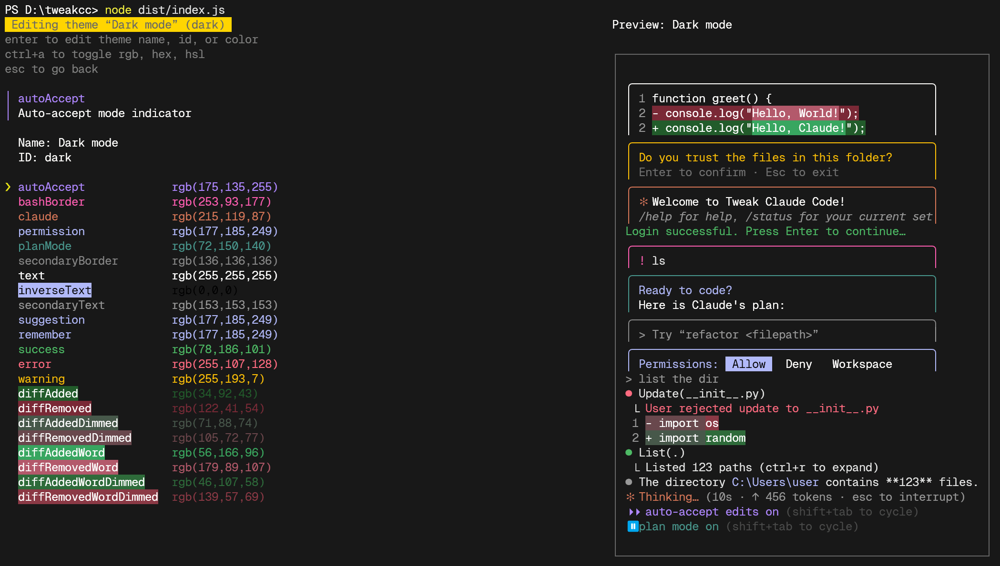
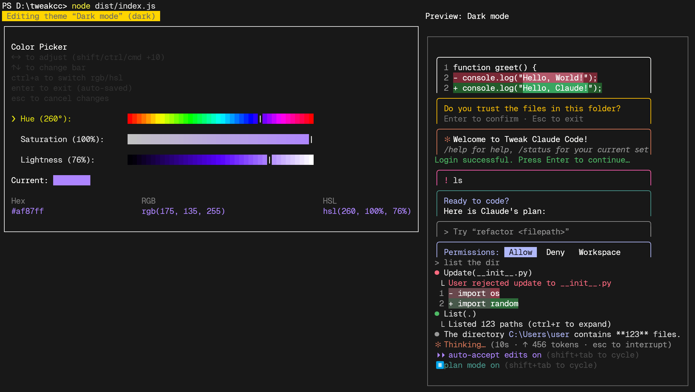
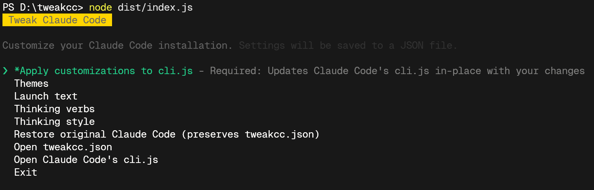
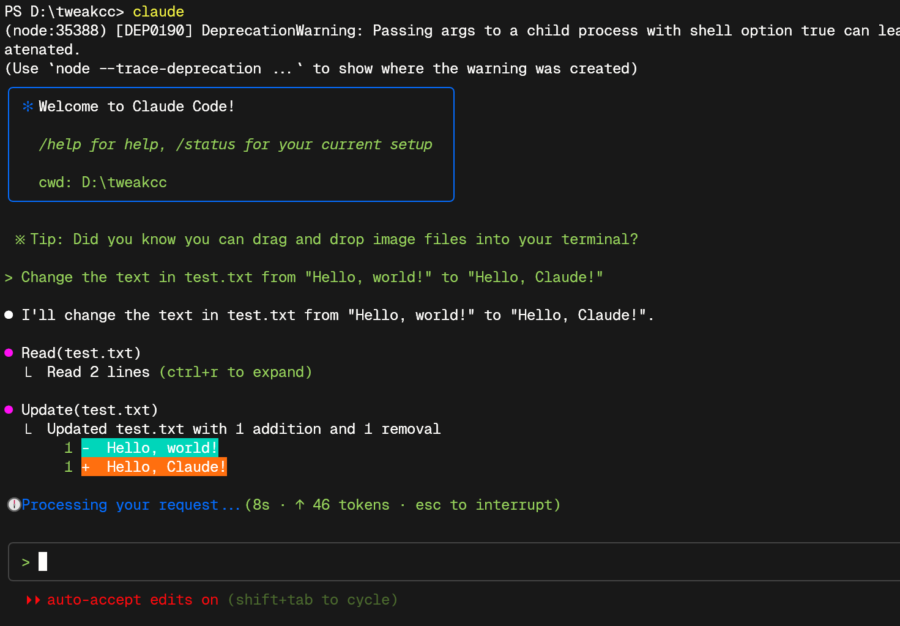

# tweakcc

Customize your Claude Code installations styles.

```
npx tweakcc
```

Create custom themes, change the list of verbs shown during generation (when Haiku generation is turned off), change the spinner animation, and the banner text shown when you sign in.  More options are coming soon, such as adding adding elements to the footer, customizing the generation status line, and modifying prompts used in generation.

tweakcc works by patching the Claude Code's minified `cli.js` file.  When you update your Claude Code installation, your customizations will be overwritten, but they're remembered in your `~/.tweakcc/config.js` configuration file, so they can be reapplied by just rerunning the tool.

Works with Claude Code 1.0.60.

## Running

Use `npx tweakcc` or build and run it locally:

```
git clone https://github.com/Piebald-AI/tweakcc.git
cd tweakcc
pnpm i
pnpm build
node dist/index.js
```

## Demo

Edit themes:



Built-in color picker:



Edit the thinking spinner:


Apply your changes:



Run Claude Code!



## License

[MIT](./LICENSE)

Copyright © 2025 [Piebald LLC](https://piebald.ai).
